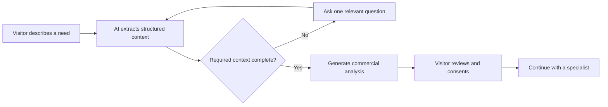

# Luminar Smart

An AI-powered lead qualification experience for an insurance brokerage. Luminar Smart turns open-ended conversations into structured commercial context and prepares a consent-based handoff to a human specialist.

This repository is a presentation-ready proof of concept that demonstrates how generative AI can support insurance sales without replacing professional advice.

## Product overview

Visitors describe what they need in their own words. The assistant identifies their profile and insurance intent, asks one relevant follow-up question at a time, and only completes qualification after collecting the required context.

The result is a concise commercial analysis that visitors can review, edit, and voluntarily share with a Luminar specialist through WhatsApp.

## Highlights

- Natural-language qualification for individual and business customers
- Context-aware questions based on the insurance category
- Structured extraction of profile, intent, location, current coverage, goals, and urgency
- Server-validated state that prevents premature qualification
- Editable specialist summary with explicit sharing consent
- Graceful human handoff when the AI provider is unavailable
- Persistent conversation memory across browser restarts
- Responsive and accessible desktop/mobile interface
- Installable PWA with offline shell and locally preserved conversation
- Premium visual direction tailored to the insurance market

## How it works



The model proposes a response and a structured qualification state. The server validates that state, calculates the required fields for the detected scenario, and decides whether to continue or generate the final analysis. Completion criteria therefore remain in application code instead of relying exclusively on model behavior.

## Tech stack

- [Astro](https://astro.build/) with server-side rendering
- TypeScript
- SCSS with component-scoped styles
- OpenAI Responses API
- JSON Schema structured outputs
- Native browser APIs and versioned `localStorage`

## Architecture

```text
src/
|-- components/
|   |-- chat-message/          Message presentation
|   |-- luminar-smart/         Chat interface and client behavior
|   `-- qualification-card/    Structured analysis presentation
|-- pages/
|   |-- api/chat.ts            AI orchestration and server validation
|   `-- index.astro            Landing page
`-- styles/                    Global and page-level styles
```

The API key is read exclusively by the server route. It is never embedded in client-side JavaScript or returned to the browser. Model responses are constrained by a strict schema and validated again before reaching the interface.

Conversation messages and the structured qualification state are stored only in the visitor's browser. This local memory survives page reloads and browser restarts until the visitor uses **Reiniciar conversa** or clears the site's browser data; no conversation database is used.

## Run locally

Requirements: Node.js 20+ and an OpenAI API key with access to the configured model.

```bash
git clone git@github.com:ruanmbramalho/luminar-smart-demo.git
cd luminar-smart-demo
npm install
cp .env.example .env
npm run dev
```

On Windows PowerShell, replace the copy command with:

```powershell
Copy-Item .env.example .env
```

Configure `.env`:

```env
LLM_API_KEY=your_openai_api_key
LLM_MODEL=gpt-5-mini
```

Open [http://localhost:4321](http://localhost:4321).

### Install as an app

On supported browsers, use the **Install app** action in the header. On iOS, use the browser share menu and choose **Add to Home Screen**. Installation requires HTTPS in production (localhost is accepted during development).

The PWA caches only the application shell and static assets. Conversation memory remains local to the device, while AI requests are never cached and still require an internet connection.

## Validation and production build

```bash
npm run check
npm run build
npm run preview
```

## Development workflow

The repository uses a lightweight branch strategy:

- `main`: production-ready code deployed by Hostinger
- `develop`: integration branch for approved changes
- `feature/*`: new product functionality
- `fix/*`: bug fixes
- `chore/*`: tooling, infrastructure, and maintenance
- `docs/*`: documentation-only changes

Create working branches from `develop` and open a pull request back into `develop`. When a release is ready, open a pull request from `develop` into `main`.

```bash
git switch develop
git pull
git switch -c feature/short-description

# Work and commit normally
git push -u origin feature/short-description
```

GitHub Actions runs the TypeScript validation and production build on pull requests and pushes to `develop` or `main`. Hostinger handles continuous deployment from `main`, so only reviewed release merges reach the public environment.

## Safety and privacy

- The assistant does not request CPF/CNPJ, full addresses, payment details, medical information, or other sensitive data.
- User input is treated as untrusted content and cannot override agent instructions.
- Request size, message count, response format, and model output are validated server-side.
- Provider requests use a timeout, limited retries, and non-persistent processing (`store: false`).
- Conversation memory is local to the browser and can be erased at any time with **Reiniciar conversa**.
- WhatsApp handoff requires explicit consent and allows the visitor to edit the context before sharing.
- Results are preliminary qualification, not insurance, legal, medical, or financial advice.

## Prototype boundaries

This is a portfolio proof of concept, not a production insurance platform. It intentionally excludes authentication, databases, CRM synchronization, WhatsApp Business API automation, analytics, RAG, and production infrastructure. The handoff opens a prefilled WhatsApp conversation after consent; it does not send data automatically.

## Design rationale

This experience was designed for a commercial presentation, not as a generic chatbot. Its dark palette, restrained gold accents, progressive conversation, and structured analysis communicate trust, clarity, and premium positioning while keeping the interaction lightweight.

## Author

Built by [Ruan Bramalho](https://github.com/ruanmbramalho) as a product and AI engineering portfolio project.

## License

Shared publicly for portfolio and demonstration purposes. No license is currently granted for commercial reuse, redistribution, or derivative works.
